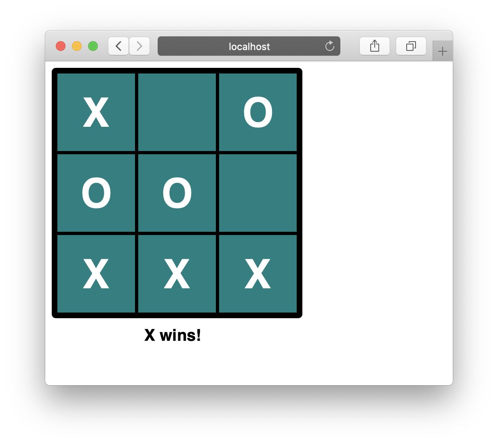

# mvc-tictactoe
A Tic tac toe game made in Javascript using the MVC pattern.

## Article
Read the article about why/how this app was built at [Hacker Noon](https://hackernoon.com/writing-a-simple-mvc-model-view-controller-app-in-vanilla-javascript-u65i34lx) 

## Live Demo
A live demo can be found [here](https://raw.githack.com/elshaka/mvc-tictactoe/master/dist/index.html)

## Built With
- HTML, CSS
- JavaScript

## Author
👤 **Eleazar Meza**

- Github: [@elshaka](https://github.com/elshaka)
- Twitter: [@elshaka](https://twitter.com/elshaka)
- Linkedin: [Eleazar Meza](https://www.linkedin.com/in/elshaka/)

## 🤝 Contributing
Contributions, issues and feature requests are welcome!

Feel free to check the [issues page](issues/).

## Show your support
Give a ⭐️ if you like this project!

## 📝 License

This project is [MIT](lic.url) licensed.
